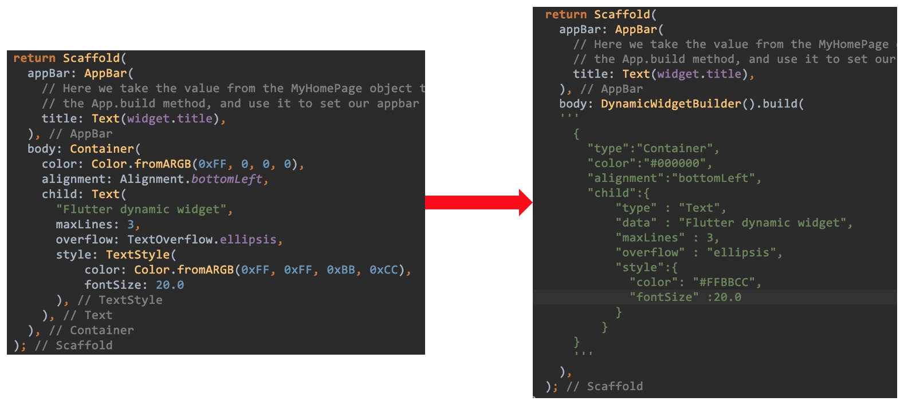
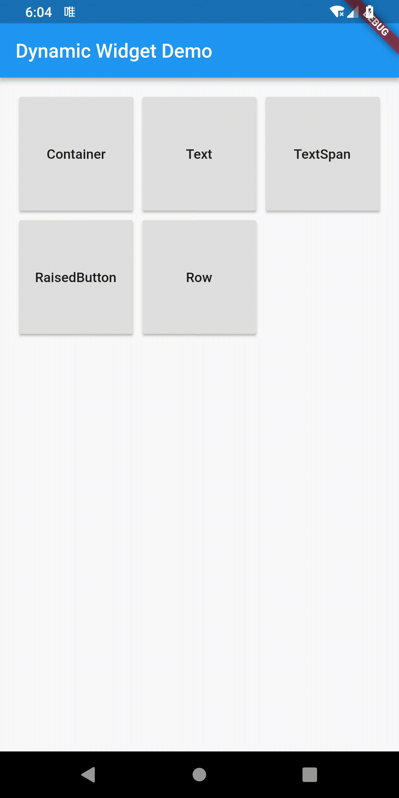

# Flutter Dynamic Widget
>You can dynamic update your flutter page with Flutter Dynamic Widget. It's a light json UI protocol, which is very similar with flutter widget code. So you don't need to learn another UI protocol, if you are familiar with flutter widget, you might already know how to write Flutter Dynamic Widget json.   

## Table of contents
* [General info](#general-info)
* [Screenshots](#screenshots)
* [Documents](#documents)
* [Setup](#setup)
* [Features](#features)
* [Status](#status)
* [Inspiration](#inspiration)
* [Contact](#contact)

## General info

> I work for an e-commerce company. We need to build flexible pages. So we define a light UI protocol, and implement on Android and iOS. We can dynamic update App UIs by pushing a json file. With this ability, we can do some UI A/B testing without publishing App to app store. Flutter allows you to build beautiful native apps on iOS and Android from a single codebase, it can allow you to build web app later. Flutter's hot reload helps you quickly and easily experiment, build UIs, add features, and fix bugs faster. But it still build native app, the UIs can't be dynamic updated. If you want to modify the UIs, you need to publish the updated app to app store. With this project, you can build your UIs from a json string, which is the UI protocal. The json string is very similar with the Flutter widget dart code. All widget type and widget properties are the same. 
    

Widget type will be a type property, and widget's properties will be the json properties too. All properties and their values will be almost the same. You can checkout the following document.

## Screenshots

## Documents
[Flutter Widgets](WIDGETS.md)

## Setup
Checkout this project and run deom.

## Code Examples
Checkout this project and run deom.

## Features
Already completed widgets:
* Container
* Text & TextSpan

You can view [all widgets definition](WIDGETS.md) here.

## Status
Project is: _in progress_, _finished_, _no longer continue_ and why?

## Inspiration
Add here credits. Project inspired by..., based on...

## Contact
Created by [@deng.yin@gmail.com](https://www.jianshu.com/u/efa51344ce61) - feel free to contact me!