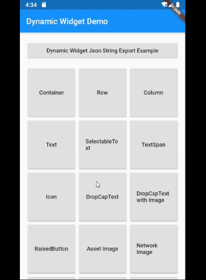

[](https://pub.dev/packages/dynamic_widget)&nbsp;
<a href="https://github.com/Solido/awesome-flutter">
    
</a>
# Flutter Dynamic Widget
>A Backend-Driven UI toolkit, build your dynamic UI with json, and the json format is very similar with flutter widget code.

**From 4.0.0-nullsafety.1 version, it supports null-safety.**

**From 3.0.0 version, it supports exporting your flutter code to json code. please check [How to write the json code](#how-to-write-the-json-code)**

**From 1.0.4 version, it supports flutter web application.**


## Table of contents
* [General info](#general-info)
* [Screenshots](#screenshots)
* [Install](#install)
* [Get started](#get-started)
* [How to implement a WidgetParser](#how-to-implement-a-widgetparser)
* [How to add a click listener](#how-to-add-a-click-listener)
* [How to write the json code](#how-to-write-the-json-code)
* [Widget Documents](#widget-documents)
* [Setup](#setup)
* [Contact](#contact)

## General info

> I work for an e-commerce company. We need to build flexible pages. So we define a light UI protocol, and implement on Android and iOS. We can dynamic update App UIs by pushing a json file. With this ability, we can do some UI A/B testing without publishing App to app store. Flutter allows you to build beautiful native apps on iOS and Android from a single codebase, it can allow you to build web app later. Flutter's hot reload helps you quickly and easily experiment, build UIs, add features, and fix bugs faster. But it still build native app, the UIs can't be dynamic updated. If you want to modify the UIs, you need to publish the updated app to app store. With this project, you can build your UIs from a json string, which is the UI protocol. The json string is very similar with the Flutter widget dart code. All widget type and widget properties are the same.


Widget type will be a type property, and widget's properties will be the json properties too. All properties and their values will be almost the same. You can checkout the following document.

[Currently support flutter widgets and properties](WIDGETS.md)

## Screenshots


## Install
#### 1. Depend on it
Add this to your package's pubspec.yaml file:
```
dependencies:
  dynamic_widget: ^3.0.3
```

#### 2. Install it
You can install packages from the command line:

with Flutter:
```
$ flutter packages get
```

Alternatively, your editor might support `flutter packages get`. Check the docs for your editor to learn more.

#### 3. Import it
Now in your Dart code, you can use:
```dart
import 'package:dynamic_widget/dynamic_widget.dart';
```

## Get started
You should use `DynamicWidgetBuilder().build` method to covert a json string into flutter widget. It will be time-consuming. so you'd better using `FutureBuilder` to build the UI.

```dart
import 'package:dynamic_widget/dynamic_widget.dart';
class PreviewPage extends StatelessWidget {
  final String jsonString;

  PreviewPage(this.jsonString);

  @override
  Widget build(BuildContext context) {
    return Scaffold(
      appBar: AppBar(
        // Here we take the value from the MyHomePage object that was created by
        // the App.build method, and use it to set our appbar title.
        title: Text("Preview"),
      ),
      body: FutureBuilder<Widget>(
        future: _buildWidget(context),
        builder: (BuildContext context, AsyncSnapshot<Widget> snapshot) {
          if (snapshot.hasError) {
            print(snapshot.error);
          }
          return snapshot.hasData
              ? SizedBox.expand(
                  child: snapshot.data,
                )
              : Text("Loading...");
        },
      ),
    );
  }

  Future<Widget> _buildWidget(BuildContext context) async {
    return DynamicWidgetBuilder.build(jsonString, context, new DefaultClickListener());
  }
}
```
## How to implement a WidgetParser
1. You need to implement the `WidgetParser` abstract class.
2. Add new created WidgetParser by `DynamicWidgetBuilder.addParser(WidgetParser parser)` method.

This is a RaisedButton widget parser.
```dart
import 'package:dynamic_widget/dynamic_widget/utils.dart';
import 'package:dynamic_widget/dynamic_widget.dart';
import 'package:flutter/material.dart';

class RaisedButtonParser extends WidgetParser {
  @override
  String get widgetName => "RaisedButton";

  @override
  Widget parse(Map<String, dynamic> map, BuildContext buildContext, ClickListener listener) {
    String clickEvent =
        map.containsKey("click_event") ? map['click_event'] : "";

    var raisedButton = RaisedButton(
      color: map.containsKey('color') ? parseHexColor(map['color']) : null,
      disabledColor: map.containsKey('disabledColor')
          ? parseHexColor(map['disabledColor'])
          : null,
      disabledElevation:
          map.containsKey('disabledElevation') ? map['disabledElevation']?.toDouble() : 0.0,
      disabledTextColor: map.containsKey('disabledTextColor')
          ? parseHexColor(map['disabledTextColor'])
          : null,
      elevation: map.containsKey('elevation') ? map['elevation']?.toDouble() : 0.0,
      padding: map.containsKey('padding')
          ? parseEdgeInsetsGeometry(map['padding'])
          : null,
      splashColor: map.containsKey('splashColor')
          ? parseHexColor(map['splashColor'])
          : null,
      textColor:
          map.containsKey('textColor') ? parseHexColor(map['textColor']) : null,
      child: DynamicWidgetBuilder.buildFromMap(map['child'], buildContext, listener),
      onPressed: () {
        listener.onClicked(clickEvent);
      },
    );

    return raisedButton;
  }
}
```

Add it to parsers list.
```dart
DynamicWidgetBuilder.addParser(RaisedButtonParser());
```
## How to add a click listener
Add "click_event" property to your widget json definition. for example:
```dart
var raisedButton_json =
'''
{
  "type": "Container",
  "alignment": "center",
  "child": {
    "type": "RaisedButton",
    "color": "##FF00FF",
    "padding": "8,8,8,8",
    "textColor": "#00FF00",
    "elevation" : 8.0,
    "splashColor" : "#00FF00",
    "click_event" : "route://productDetail?goods_id=123",
    "child" : {
      "type": "Text",
      "data": "I am a button"
    }
  }
}
```

We suggest you'd better to use an URI to define the event, as the exmaple, it's a event for going to a product detail page.

Then, define a ClickListener
```dart
class DefaultClickListener implements ClickListener{
  @override
  void onClicked(String event) {
    print("Receive click event: " + event);
  }

}
```

Finally, pass the listener to build method.
```dart
  Future<Widget> _buildWidget() async{

    return DynamicWidgetBuilder.build(jsonString, buildContext, new DefaultClickListener());
  }
```

## How to write the json code
You don't need to write the json code by hand, you can export your flutter code to json code efficiently with DynamicWidgetJsonExportor widget. You just need to wrap your flutter code with DynamicWidgetJsonExportor widget, then invoke its `exportJsonString()` method, look at following example, click the "export" button, it will find the DynamicWidgetJsonExportor widget, and export its child to json code efficiently.

```dart
class _JSONExporterState extends State<JSONExporter> {
  GlobalKey key = GlobalKey();

  @override
  Widget build(BuildContext context) {
    return Scaffold(
      appBar: AppBar(
        // Here we take the value from the MyHomePage object that was created by
        // the App.build method, and use it to set our appbar title.
        title: Text("export example"),
      ),
      body: Builder(
        builder: (context) => Column(
          children: [
            Expanded(
              child: DynamicWidgetJsonExportor(
                key: key,
                child: Container(
                  child: GridViewWidget(
                      GridViewParams(
                          mainAxisSpacing: 2.0,
                          crossAxisSpacing: 2.0,
                          crossAxisCount: 2,
                          childAspectRatio: 1.6,
                          padding: EdgeInsets.all(10.0),
                          pageSize: 10,
                          children: [
                            ListTile(
                              leading: Text("Leading text"),
                              title: Text("title"),
                              subtitle: Text("subtitle"),
                            ),
                            ListTile(
                              leading: Text("Leading text"),
                              title: Text("title"),
                              subtitle: Text("subtitle"),
                            )
                          ]),
                      context),
                ),
              ),
            ),
            RaisedButton(
              child: Text("Export"),
              onPressed: () {
                var exportor = key.currentWidget as DynamicWidgetJsonExportor;
                var exportJsonString = exportor.exportJsonString();
                Scaffold.of(context).showSnackBar(SnackBar(
                    content: Text("json string was exported to editor page.")));
                Future.delayed(Duration(seconds: 3), (){
                  Navigator.push(
                      context,
                      MaterialPageRoute(
                          builder: (context) =>
                              CodeEditorPage(exportJsonString)));
                });
              },
            )
          ],
        ),
      ),
    );
  }
}
```
You can use whatever your favorite IDE to build the UI, then use DynamicWidgetJsonExportor to export to json code. For detail, please check the Dynamic Widget Demo source code.




## Widget Documents
Already completed widgets:
* [Container](https://github.com/dengyin2000/dynamic_widget/blob/master/WIDGETS.md#container-widget)
* [Text](https://github.com/dengyin2000/dynamic_widget/blob/master/WIDGETS.md#text-widget)
* [TextSpan](https://github.com/dengyin2000/dynamic_widget/blob/master/WIDGETS.md#textspan)
* [TextStyle](https://github.com/dengyin2000/dynamic_widget/blob/master/WIDGETS.md#textstyle)
* [RaisedButton](https://github.com/dengyin2000/dynamic_widget/blob/master/WIDGETS.md#raisedbutton-widget)
* [ElevatedButton](https://github.com/dengyin2000/dynamic_widget/blob/master/WIDGETS.md#elevatedbutton-widget)
* [TextButton](https://github.com/dengyin2000/dynamic_widget/blob/master/WIDGETS.md#textbutton-widget)
* [Row](https://github.com/dengyin2000/dynamic_widget/blob/master/WIDGETS.md#row-widget)
* [Column](https://github.com/dengyin2000/dynamic_widget/blob/master/WIDGETS.md#column-widget)
* [AssetImage](https://github.com/dengyin2000/dynamic_widget/blob/master/WIDGETS.md#assetimage-widget)
* [NetworkImage](https://github.com/dengyin2000/dynamic_widget/blob/master/WIDGETS.md#networkimage-widget)
* [FileImage](https://github.com/dengyin2000/dynamic_widget/blob/master/WIDGETS.md#fileimage-widget)
* [Placeholder](https://github.com/dengyin2000/dynamic_widget/blob/master/WIDGETS.md#placeholder-widget)
* [GridView](https://github.com/dengyin2000/dynamic_widget/blob/master/WIDGETS.md#gridview-widget)
* [ListView](https://github.com/dengyin2000/dynamic_widget/blob/master/WIDGETS.md#listview-widget)
* [PageView](https://github.com/dengyin2000/dynamic_widget/blob/master/WIDGETS.md#pageview-widget)
* [Expanded](https://github.com/dengyin2000/dynamic_widget/blob/master/WIDGETS.md#expanded-widget)
* [Padding](https://github.com/dengyin2000/dynamic_widget/blob/master/WIDGETS.md#padding-widget)
* [Center](https://github.com/dengyin2000/dynamic_widget/blob/master/WIDGETS.md#center-widget)
* [Align](https://github.com/dengyin2000/dynamic_widget/blob/master/WIDGETS.md#align-widget)
* [AspectRatio](https://github.com/dengyin2000/dynamic_widget/blob/master/WIDGETS.md#aspectratio-widget)
* [FittedBox](https://github.com/dengyin2000/dynamic_widget/blob/master/WIDGETS.md#fittedbox-widget)
* [Baseline](https://github.com/dengyin2000/dynamic_widget/blob/master/WIDGETS.md#baseline-widget)
* [Stack](https://github.com/dengyin2000/dynamic_widget/blob/master/WIDGETS.md#stack-widget)
* [Positioned](https://github.com/dengyin2000/dynamic_widget/blob/master/WIDGETS.md#positioned-widget)
* [IndexedStack](https://github.com/dengyin2000/dynamic_widget/blob/master/WIDGETS.md#indexedstack-widget)
* [ExpandedSizedBox](https://github.com/dengyin2000/dynamic_widget/blob/master/WIDGETS.md#expandedsizedbox-widget)
* [SizedBox](https://github.com/dengyin2000/dynamic_widget/blob/master/WIDGETS.md#sizedbox-widget)
* [Opacity](https://github.com/dengyin2000/dynamic_widget/blob/master/WIDGETS.md#opacity-widget)
* [Wrap](https://github.com/dengyin2000/dynamic_widget/blob/master/WIDGETS.md#wrap-widget)
* [ClipRRect](https://github.com/dengyin2000/dynamic_widget/blob/master/WIDGETS.md#cliprrect-widget)
* [SafeArea](https://github.com/dengyin2000/dynamic_widget/blob/master/WIDGETS.md#safearea-widget)
* [SelectableText](https://github.com/dengyin2000/dynamic_widget/blob/master/WIDGETS.md#selectabletext-widget)
* [Icon](https://github.com/dengyin2000/dynamic_widget/blob/master/WIDGETS.md#icon-widget)
* [DropCapText](https://github.com/dengyin2000/dynamic_widget/blob/master/WIDGETS.md#dropcaptext-widget)
* [Scaffold](https://github.com/dengyin2000/dynamic_widget/blob/master/WIDGETS.md#scaffold-widget)
* [AppBar](https://github.com/dengyin2000/dynamic_widget/blob/master/WIDGETS.md#appbar-widget)
* [LimitedBox](https://github.com/dengyin2000/dynamic_widget/blob/master/WIDGETS.md#limitedbox-widget)
* [Offstage](https://github.com/dengyin2000/dynamic_widget/blob/master/WIDGETS.md#offstage-widget)
* [OverflowBox](https://github.com/dengyin2000/dynamic_widget/blob/master/WIDGETS.md#overflowbox-widget)
* [Divider](https://github.com/dengyin2000/dynamic_widget/blob/master/WIDGETS.md#divider-widget)
* [RotatedBox](https://github.com/dengyin2000/dynamic_widget/blob/master/WIDGETS.md#rotatedbox-widget)
* [SingleChildScrollView](https://github.com/dengyin2000/dynamic_widget/blob/master/WIDGETS.md#singlechildscrollview-widget)

You can view [Currently support widgets and properties](WIDGETS.md) here.

## Setup
Checkout this project and run demo.

## Code Examples
Checkout this project and run demo.

## Contact
Created by [@deng.yin@gmail.com](https://www.jianshu.com/u/efa51344ce61) - feel free to contact me